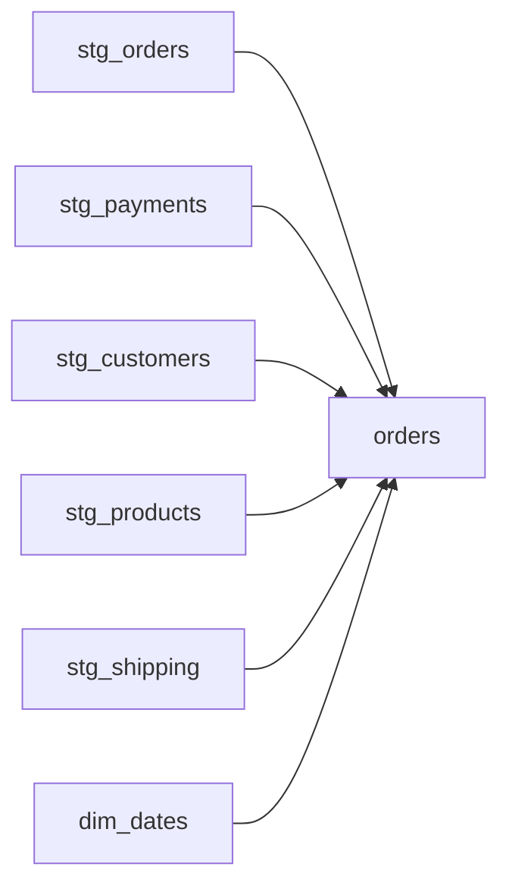
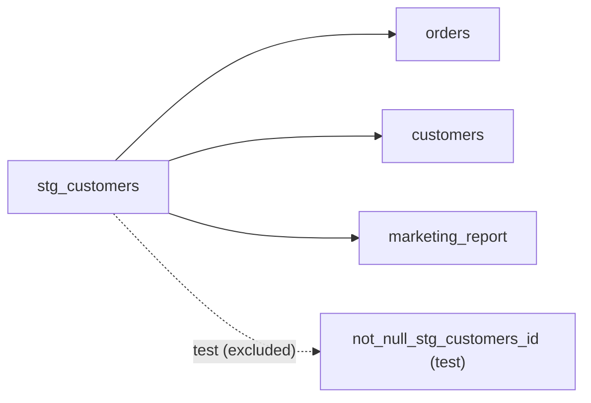

<hr style="border: 1px solid #666; margin: 2em 0;">

### Rule: `max_upstream_dependencies`

<span class="rule-category-badge badge-manifest">Manifest Rule</span>

<details open>
<summary>max_upstream_dependencies details</summary>
<br>
This rule limits <b>fan-in</b>. It checks how many <code>{{ ref() }}</code> and <code>{{ source() }}</code> calls a single model has. Models that select from too many places should be broken into smaller, more focused models.

By default, dbt test objects are excluded from the count. This is configurable via <code>exclude_types</code>.

---

**Configuration**

- **type**: Must be `max_upstream_dependencies`.
- **max_upstream**: _(optional)_ Maximum number of `ref()` and `source()` calls a model is allowed to have. Defaults to `5`.
- **exclude_types**: _(optional)_ List of object types to ignore when counting upstream dependencies. For example, `["tests"]` means dbt tests configured on a model won't count towards its upstream limit.
  - Default: `["tests"]`
  - Options: `models`, `seeds`, `sources`, `snapshots`, `tests`, `macros`, `exposures`
- **applies_to**: _(optional)_ List of dbt object types this rule checks.
  - Default: `["models", "snapshots"]`
  - Options: `models`, `seeds`, `snapshots`, `sources`



**Example Config**





```yaml
manifest_tests:
  - name: "limit_upstream_deps"
    type: "max_upstream_dependencies"
    max_upstream: 5
    description: "Models should not select from more than 5 ref() and source() calls"
    # exclude_types: ["tests"]  (optional, default)
    # severity: "warning"  (optional)
    # applies_to: ['models', 'snapshots'] (optional)
    # includes: ["models/marts/*"]
    # excludes: ["models/staging/*"]

  # Stricter limit for staging models
  - name: "staging_limited_deps"
    type: "max_upstream_dependencies"
    max_upstream: 2
    includes: ["models/staging"]
    exclude_types: ["tests", "macros"]
    severity: "error"
```





```toml
[[manifest_tests]]
name = "limit_upstream_deps"
type = "max_upstream_dependencies"
max_upstream = 5
description = "Models should not select from more than 5 ref() and source() calls"
# exclude_types = ["tests"]  # (optional, default)
# severity = "warning"  # (optional)
# applies_to = ["models", "snapshots"]  # (optional)
# includes = ["models/marts/*"]
# excludes = ["models/staging/*"]

# Stricter limit for staging models
[[manifest_tests]]
name = "staging_limited_deps"
type = "max_upstream_dependencies"
max_upstream = 2
includes = ["models/staging"]
exclude_types = ["tests", "macros"]
severity = "error"
```





```toml
[[tool.dbtective.manifest_tests]]
name = "limit_upstream_deps"
type = "max_upstream_dependencies"
max_upstream = 5
description = "Models should not select from more than 5 ref() and source() calls"
# exclude_types = ["tests"]  # (optional, default)
# severity = "warning"  # (optional)
# applies_to = ["models", "snapshots"]  # (optional)
# includes = ["models/marts/*"]
# excludes = ["models/staging/*"]

# Stricter limit for staging models
[[tool.dbtective.manifest_tests]]
name = "staging_limited_deps"
type = "max_upstream_dependencies"
max_upstream = 2
includes = ["models/staging"]
exclude_types = ["tests", "macros"]
severity = "error"
```





<details closed>
<summary>Example</summary>

The rule inspects the `parent_map` from `manifest.json`. For example:



 

```json
"parent_map": {
  "model.project.orders": [
    "model.project.stg_orders",
    "model.project.stg_payments",
    "model.project.stg_customers",
    "model.project.stg_products",
    "model.project.stg_shipping",
    "model.project.dim_dates"
  ]
}
```

With `max_upstream: 5`, the `orders` model would **fail** because it selects from 6 other models (i.e. 6 upstream dependencies, which exceeds the limit of 5).

</details>

</details>

<hr style="border: 2px solid #444; margin: 2em 0;">

### Rule: `max_downstream_dependencies`

<span class="rule-category-badge badge-manifest">Manifest Rule</span>

<details open>
<summary>max_downstream_dependencies details</summary>
<br>
This rule limits <b>fan-out</b>. It checks how many other models reference a single model via <code>{{ ref() }}</code>. For example, sources should be consumed by only one downsteam model.

By default, dbt test objects are excluded from the count. This is configurable via <code>exclude_types</code>.

---

**Configuration**

- **type**: Must be `max_downstream_dependencies`.
- **max_downstream**: _(optional)_ Maximum number of other models that are allowed to `ref()` this model. Defaults to `5`.
- **exclude_types**: _(optional)_ List of object types to ignore when counting downstream dependents. For example, `["tests"]` means dbt tests configured on a model won't count towards its downstream limit.
  - Default: `["tests"]`
  - Options: `models`, `seeds`, `sources`, `snapshots`, `tests`, `macros`, `exposures`
- **applies_to**: _(optional)_ List of dbt object types this rule checks.
  - Default: `["models", "snapshots"]`
  - Options: `models`, `seeds`, `snapshots`, `sources`



**Example Config**





```yaml
manifest_tests:
  - name: "limit_downstream_deps"
    type: "max_downstream_dependencies"
    max_downstream: 5
    description: "Reduce model fanout complexity"
    applies_to: ["models"]
    # exclude_types: ["tests"]  (optional, default)
    # severity: "warning"  (optional)
    # includes: ["models/staging/*"]
    # excludes: ["models/marts/*"]

  # Sources should only be consumed by a single staging model
  - name: "source_max_downstream_dependencies"
    type: "max_downstream_dependencies"
    max_downstream: 1
    description: "Sources should not be referenced by more than 1 model (use a staging model)"
    applies_to: ["sources"]
```





```toml
[[manifest_tests]]
name = "limit_downstream_deps"
type = "max_downstream_dependencies"
max_downstream = 5
description = "Reduce model fanout complexity"
applies_to = ["models"]
# exclude_types = ["tests"]  # (optional, default)
# severity = "warning"  # (optional)
# includes = ["models/staging/*"]
# excludes = ["models/marts/*"]

# Sources should only be consumed by a single staging model
[[manifest_tests]]
name = "source_max_downstream_dependencies"
type = "max_downstream_dependencies"
max_downstream = 1
description = "Sources should not be referenced by more than 1 model (use a staging model)"
applies_to = ["sources"]
```





```toml
[[tool.dbtective.manifest_tests]]
name = "limit_downstream_deps"
type = "max_downstream_dependencies"
max_downstream = 5
description = "Reduce model fanout complexity"
applies_to = ["models"]
# exclude_types = ["tests"]  # (optional, default)
# severity = "warning"  # (optional)
# includes = ["models/staging/*"]
# excludes = ["models/marts/*"]

# Sources should only be consumed by a single staging model
[[tool.dbtective.manifest_tests]]
name = "source_max_downstream_dependencies"
type = "max_downstream_dependencies"
max_downstream = 1
description = "Sources should not be referenced by more than 1 model (use a staging model)"
applies_to = ["sources"]
```





<details closed>
<summary>Example</summary>

The rule inspects the `child_map` from `manifest.json`. For example:



```json
"child_map": {
  "model.project.stg_customers": [
    "model.project.orders",
    "model.project.customers",
    "model.project.marketing_report",
    "test.project.not_null_stg_customers_id"
  ]
}
```

With `max_downstream: 5` and `exclude_types: ["tests"]`, the `stg_customers` model is referenced by 3 other models (the test is excluded from the count), so it would **pass**.

</details>

</details>
