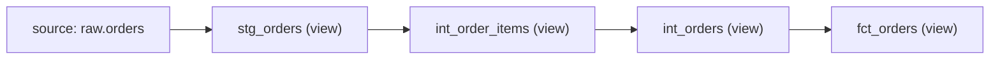
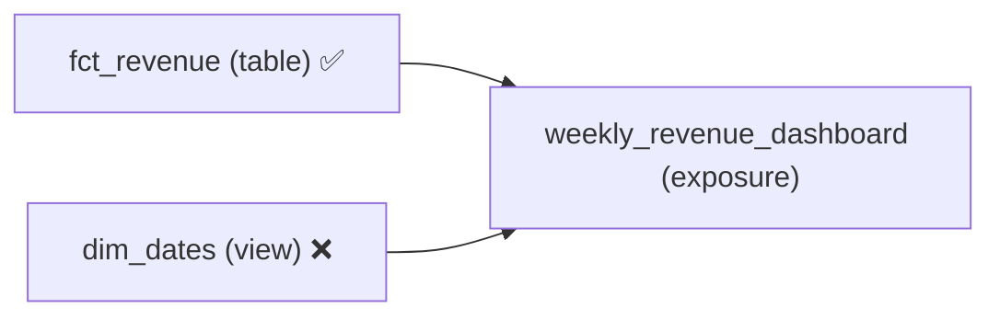

<hr style="border: 1px solid #666; margin: 2em 0;">

### Rule: `max_materialization_lineage`

<span class="rule-category-badge badge-manifest">Manifest Rule</span>

<details open>
<summary>max_materialization_lineage details</summary>
<br>
This rule limits the length of consecutive non-persisted materializations in a model's lineage. It walks up the DAG via <code>parent_map</code>, counting consecutive ancestors whose materialization is in the <code>included_materializations</code> set (default: <code>view</code> and <code>ephemeral</code>). The walk stops at non-model parents (sources, seeds, etc.) and at models with a materialization not in the included set.

When a node has multiple parents (diamond patterns), the <b>longest</b> chain is used.

Models whose own materialization is not in the included set are skipped entirely.

---

**Configuration**

- **type**: Must be `max_materialization_lineage`.
- **max**: _(optional)_ Maximum number of consecutive non-persisted models allowed in the lineage (including the current model). Defaults to `4`.
- **included_materializations**: _(optional)_ List of materializations considered non-persisted. Only chains of these materializations are counted.
  - Default: `["view", "ephemeral"]`
  - Options: `table`, `view`, `incremental`, `ephemeral`, `materialized_view`, or any custom materialization string.
- **applies_to**: _(optional)_ List of dbt object types this rule checks.
  - Default: `["models"]`
  - Options: `models`



**Example Config**





```yaml
manifest_tests:
  - name: "no_long_view_chains"
    type: "max_materialization_lineage"
    max: 4
    description: "Limit consecutive non-persisted materializations in lineage"
    # included_materializations: ["view", "ephemeral"]  (optional, default)
    # severity: "warning"  (optional)
    # includes: ["models/marts/*"]
    # excludes: ["models/staging/*"]

  # Stricter limit for marts
  - name: "marts_short_chains"
    type: "max_materialization_lineage"
    max: 2
    includes: ["models/marts"]
    severity: "error"
```





```toml
[[manifest_tests]]
name = "no_long_view_chains"
type = "max_materialization_lineage"
max = 4
description = "Limit consecutive non-persisted materializations in lineage"
# included_materializations = ["view", "ephemeral"]  # (optional, default)
# severity = "warning"  # (optional)
# includes = ["models/marts/*"]
# excludes = ["models/staging/*"]

# Stricter limit for marts
[[manifest_tests]]
name = "marts_short_chains"
type = "max_materialization_lineage"
max = 2
includes = ["models/marts"]
severity = "error"
```





```toml
[[tool.dbtective.manifest_tests]]
name = "no_long_view_chains"
type = "max_materialization_lineage"
max = 4
description = "Limit consecutive non-persisted materializations in lineage"
# included_materializations = ["view", "ephemeral"]  # (optional, default)
# severity = "warning"  # (optional)
# includes = ["models/marts/*"]
# excludes = ["models/staging/*"]

# Stricter limit for marts
[[tool.dbtective.manifest_tests]]
name = "marts_short_chains"
type = "max_materialization_lineage"
max = 2
includes = ["models/marts"]
severity = "error"
```





<details closed>
<summary>Example</summary>



The rule walks up the `parent_map` from `manifest.json`. For example:

```json
"parent_map": {
  "model.project.fct_orders": ["model.project.int_orders"],
  "model.project.int_orders": ["model.project.int_order_items"],
  "model.project.int_order_items": ["model.project.stg_orders"],
  "model.project.stg_orders": ["source.project.raw.orders"]
}
```

With all four models materialized as `view` and `max: 3`, the `fct_orders` model would **fail** because it has a chain of 4 consecutive views (stg_orders → int_order_items → int_orders → fct_orders), which exceeds the limit of 3.

If `int_orders` were materialized as `table`, the chain at `fct_orders` would be just 1 (only itself), because the table breaks the chain.

</details>

</details>

<hr style="border: 2px solid #444; margin: 2em 0;">

### Rule: `exposure_parents_materialized`

<span class="rule-category-badge badge-manifest">Manifest Rule</span>

<details open>
<summary>exposure_parents_materialized details</summary>
<br>
This rule ensures that every direct model parent of an exposure uses a persisted materialization. Exposures (dashboards, ML models, applications) that depend on non-persisted models (views, ephemeral) can suffer from poor query performance and stale data.

Only model parents are checked — sources and seeds are skipped since they don't have configurable materializations.

One violation is produced per non-compliant parent.

---

**Configuration**

- **type**: Must be `exposure_parents_materialized`.
- **allowed_materializations**: _(optional)_ List of materializations considered persisted/acceptable for exposure parents.
  - Default: `["table", "incremental", "materialized_view"]`
  - Options: `table`, `view`, `incremental`, `ephemeral`, `materialized_view`, or any custom materialization string.
- **applies_to**: _(optional)_ List of dbt object types this rule checks.
  - Default: `["exposures"]`
  - Options: `exposures`



**Example Config**





```yaml
manifest_tests:
  - name: "exposure_parents_must_be_materialized"
    type: "exposure_parents_materialized"
    description: "Exposure parents must use persisted materializations"
    severity: "error"
    # allowed_materializations: ["table", "incremental", "materialized_view"]  (optional, default)

  # Allow views for internal dashboards
  - name: "internal_exposure_parents"
    type: "exposure_parents_materialized"
    allowed_materializations:
      ["table", "incremental", "materialized_view", "view"]
    includes: ["models/internal/*"]
    severity: "warning"
```





```toml
[[manifest_tests]]
name = "exposure_parents_must_be_materialized"
type = "exposure_parents_materialized"
description = "Exposure parents must use persisted materializations"
severity = "error"
# allowed_materializations = ["table", "incremental", "materialized_view"]  # (optional, default)

# Allow views for internal dashboards
[[manifest_tests]]
name = "internal_exposure_parents"
type = "exposure_parents_materialized"
allowed_materializations = ["table", "incremental", "materialized_view", "view"]
includes = ["models/internal/*"]
severity = "warning"
```





```toml
[[tool.dbtective.manifest_tests]]
name = "exposure_parents_must_be_materialized"
type = "exposure_parents_materialized"
description = "Exposure parents must use persisted materializations"
severity = "error"
# allowed_materializations = ["table", "incremental", "materialized_view"]  # (optional, default)

# Allow views for internal dashboards
[[tool.dbtective.manifest_tests]]
name = "internal_exposure_parents"
type = "exposure_parents_materialized"
allowed_materializations = ["table", "incremental", "materialized_view", "view"]
includes = ["models/internal/*"]
severity = "warning"
```





<details closed>
<summary>Example exposure</summary>

Given an exposure in your dbt project:



```yaml
exposures:
  - name: weekly_revenue_dashboard
    type: dashboard
    owner:
      name: Analytics Team
    depends_on:
      - ref('fct_revenue')
      - ref('dim_dates')
```

If `fct_revenue` is materialized as `table` but `dim_dates` is materialized as `view`, the rule would produce one violation for `dim_dates` (assuming the default `allowed_materializations`).

</details>

</details>
